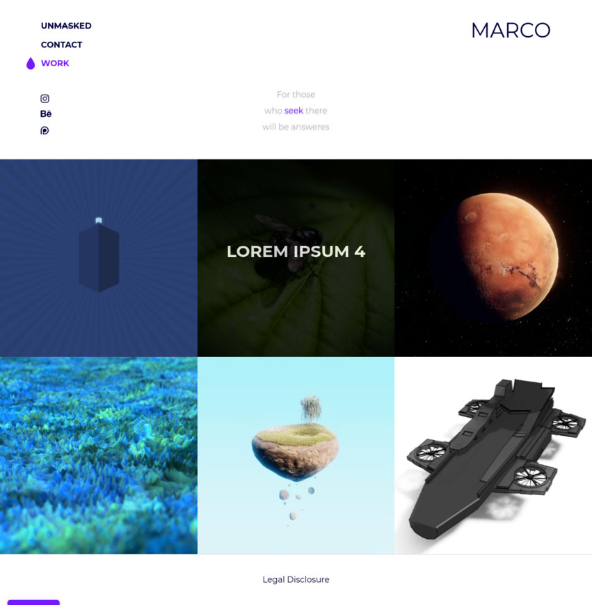

# Publii Marco Theme
Version: 1.0.1.0

A free simple to use Portfolio Theme for Publii.  
It's a CSS Grid based Layout designed by my buddy Marco, therefore the name.  
He is the one who had the Design idea.  
He is listed in the Credits tab, please check him out, his working is freaking awesome.

Lightbox Support is in the making.

### Author
Joshua Sellke [http://www.sellke.net/](http://www.sellke.net/)

### Credits
* [Marco in the Middle](https://www.instagram.com/marcointhemiddle/)

### Licence

MIT
